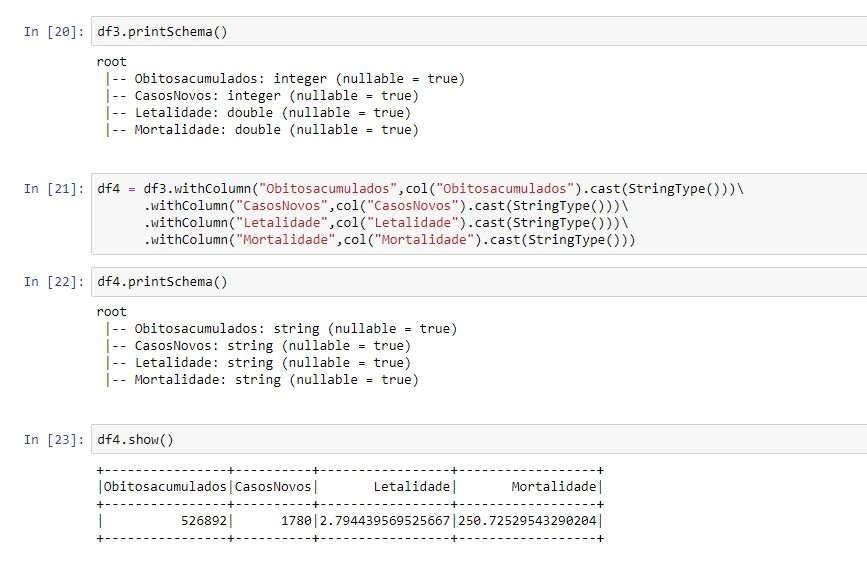

# Semantix

## Projeto Final de Spark
 Lucio José S Monteiro - lucio.suruagy@gmail.com
 
 ### Campanha Nacional de Vacinação contra Covid-19
 
 ### 1) Enviar dados para o HDFS
 
 docker exec -it namenode bash
 
   hdfs dfs -mkdir -p /user/lucio/data
   
   hdfs dfs -put /input/covid/*.csv /user/lucio/covid
   
   hdfs dfs -ls /user/lucio/covid
   
   hdfs dfs -cat /user/lucio/covid/HIST_PAINEL_COVIDBR_2020_Parte1_06jul2021.csv | head -n 3
   
  ### 2) Otimizar todos os dados do hdfs para uma tabela Hive particionada por município
   
   docker exec -it hive-server bash
   
   beeline -u jdbc:hive2://localhost:10000
   
   show databases;
   
   create database semantix;
   
   use semantix;
   
   create database covid19;
   
show databases;

use covid19;

SET hive.exec.dynamic.partition = true;

SET hive.exec.dynamic.partition.mode = nonstrict ;

create table covid_dados_orig(
regiao string,
estado string,
municipio  string,
coduf int,
codmun int,
codRegiaoSaude int,
nomeRegiaoSaude string, 
data date,
semanaEpi int,
populacaoTCU2019 int,
casosAcumulado int,
casosNovos int,
obitosAcumulado int,
obitosNovos int,
Recuperadosnovos int,
emAcompanhamentoNovos int,
interiormetropolitana int
)

row format delimited
fields terminated by ';'
stored as textfile
location '/user/lucio/covid_dados';

create table covid_municipio(
regiao string,
estado string,
coduf int,
codmun int,
codRegiaoSaude int,
nomeRegiaoSaude string, 
data date,
semanaEpi int,
populacaoTCU2019 int,
casosAcumulado int,
casosNovos int,
obitosAcumulado int,
obitosNovos int,
Recuperadosnovos int,
emAcompanhamentoNovos int,
interiormetropolitana int

)
partitioned by (municipio  string)
row format delimited
stored as textfile;

show tables;

desc formatted  covid_dados_orig;

desc formatted  covid_municipio;

select regiao, estado, data, casosacumulado from covid_dados_orig where estado ="PE" limit 10;

insert overwrite table covid_municipio partition (municipio) select * from covid_dados_orig;

show partitions covid_municipio;

hdfs dfs -ls /user/hive/warehouse/covid19.db/covid_municipio

### 3) Criar as 3 visualiações pelo Spark com os dados enviados para o HDFS:

### 4) Salvar a primeira Visualização como tabela Hive

### 5) Salvar a segunda Visualização com formato parquet e compressão Snappy

### 6) Salvar a terceira Visualização em um tópico no Kafka

docker exec -it kafka bash

kafka-topics.sh --bootstrap-server kafka:9092 --topic covid19 --create --partitions 2 --replication-factor 1

kafka-topics.sh --bootstrap-server localhost:9092 --topic covid19 --describe

kafka-console-producer.sh --broker-list localhost:9092 --topic painel-covid19

### 7) Criar a visualização pelo Spark com os dados enviados para o HDFS:

